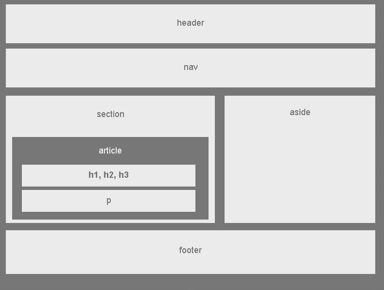

## Wireframe Test
This project was created to practice basic styling and placement with only HTML and CSS. 

## Screenshots
     

## Tech/framework used

* HTML
* CSS

## Installation
If you want to test out the code and run it yourself, or use it as a reference. 
Simply for the repository, clone it to your local machine, and run the files in your browser!

## Credits
Thankyou to my teachers and teacher's assistant(s) and the University of Toronto with the help getting started with basic coding princples.
